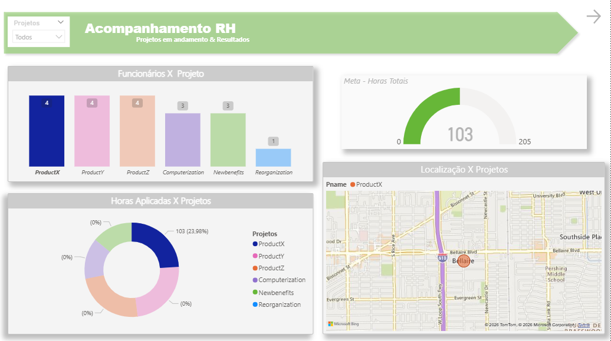

# 📊 Integração de Dados com Azure SQL e Power BI

## 📌 Descrição

Projeto focado na criação de um banco de dados no Azure SQL e integração com o Power BI para tratamento, modelagem e visualização dos dados.

---

## 🛠️ Tecnologias

* Azure SQL Database
* SQL (T-SQL)
* Power BI
* Power Query

---

## 🚀 Etapas

* Criação do banco no Azure
* Modelagem relacional (employee, departament, project, etc.)
* Inserção de dados via SQL
* Conexão com Power BI
* Transformação dos dados no Power Query
* Construção de relatório no Power BI

---

## 🔧 Tratamentos realizados

* Ajuste de tipos de dados
* Tratamento de valores nulos
* Criação de nome completo
* Junção de tabelas (employee + departament)
* Associação de colaboradores aos gerentes

---

## 📈 Resultado

Desenvolvimento de um relatório no Power BI com visualizações que permitem:

* Análise de colaboradores por gerente
* Distribuição por departamento
* Horas trabalhadas por projeto
